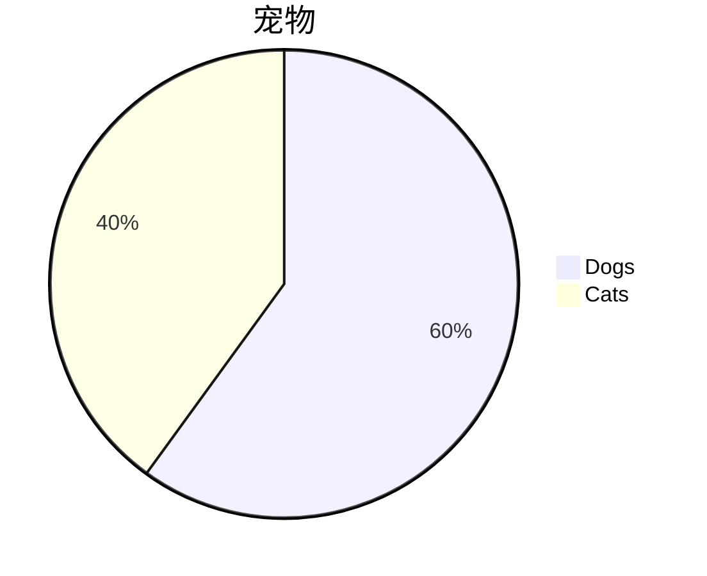
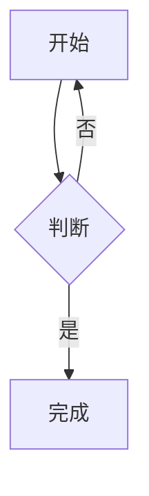

# A. 文本与结构

普通段落，含 **粗体**、_斜体_、~~删除线~~、`行内代码`、Unicode：中文、emoji 🎉、RTL: שלום。

> 引用块
>
> > 嵌套引用

1. 有序列表
2. 第二项
   - 嵌套无序

---

# B. 链接

- [外部链接（应新窗口打开，带 noopener）](https://example.com)
- [站内锚点（不应新窗口）](#a-文本与结构)
- [javascript 链接（应被丢弃）](<javascript:alert('xss-link')>)
- [协议相对链接（应被丢弃）](//evil.example/x)

# C. 图片（外部 HTTPS）

普通图片（**无 title**，这一行曾导致 WYSIWYG 整个打不开）：


带 title 的图片：


动画 GIF（应仍在动）：


data: 图片（应被丢弃）：


# D. 代码

行内 `const x = 1;`。

```js
// 语法高亮：关键字、字符串、注释都应有颜色
const greeting = "hello";
function add(a, b) {
  return a + b; // 注释
}
```

```python
def fib(n):
    return n if n < 2 else fib(n - 1) + fib(n - 2)
```

# E. 表格与任务清单

| 左           |    中    |     右 |
| :----------- | :------: | -----: |
| 1            |    2     |      3 |
| 较长的单元格 | **加粗** | `代码` |

- [x] 已完成
- [ ] 未完成

# F. 数学（KaTeX）

行内：$E = mc^2$ 与 $a^2 + b^2 = c^2$。

块级（应居中成块）：

$$
\int_0^1 x^2 \, dx = \frac{1}{3}
$$

不允许的命令（应不产生链接或属性）：
$\href{javascript:alert('xss-katex')}{click}$ 与 $\htmlData{foo=bar}{x}$

# G. Mermaid 图





# H. 嵌入：iframe 与 video（§12）

HTTPS iframe（应保留，且被沙箱隔离、无 allow-same-origin）：

<iframe src="https://www.youtube.com/embed/dQw4w9WgXcQ"></iframe>

HTTP iframe（应被删除）：

<iframe src="http://player.example/v"></iframe>

HTTPS video（应保留 controls，且不自动播放）：

<video src="https://upload.wikimedia.org/wikipedia/commons/transcoded/c/c0/Big_Buck_Bunny_4K.webm/Big_Buck_Bunny_4K.webm.360p.vp9.webm" controls></video>

# I. 安全向量（以下必须不可见或已中和）

<script>alert('xss-script')</script>


<a href="javascript:alert('xss-anchor')">危险链接</a>

<svg onload="alert('xss-svg')"><circle cx="5" cy="5" r="4" fill="#c00"/></svg>

<style>body { background: red }</style>

<form action="https://evil.example"><input type="text"><button>提交</button></form>

<input type="checkbox" checked> 这个复选框应保留

<p onclick="alert('xss-p')">这段文字应保留，但 onclick 应消失</p>

<p style="color: red; background: url(https://evil.example/track.png)">只应保留 color，url 应消失</p>

<math><mtext><script>alert('xss-math')</script></mtext></math>

<template><script>alert('xss-template')</script></template>

# J. 未知扩展必须原样保留

:::note
本应用不认识的扩展块，必须原样保留而不是被销毁。
:::

文本中的 ::marker[value] 内联自定义语法。

# K. 边界与排版

超长不换行串：abcdefghijklmnopqrstuvwxyzABCDEFGHIJKLMNOPQRSTUVWXYZ0123456789abcdefghijklmnopqrstuvwxyzABCDEFGHIJKLMNOPQRSTUVWXYZ0123456789

行尾两空格换行：第一行  
第二行

反斜杠转义：\*不是斜体\*，\`不是代码\`

HTML 实体：&lt;script&gt; &amp; &quot;
